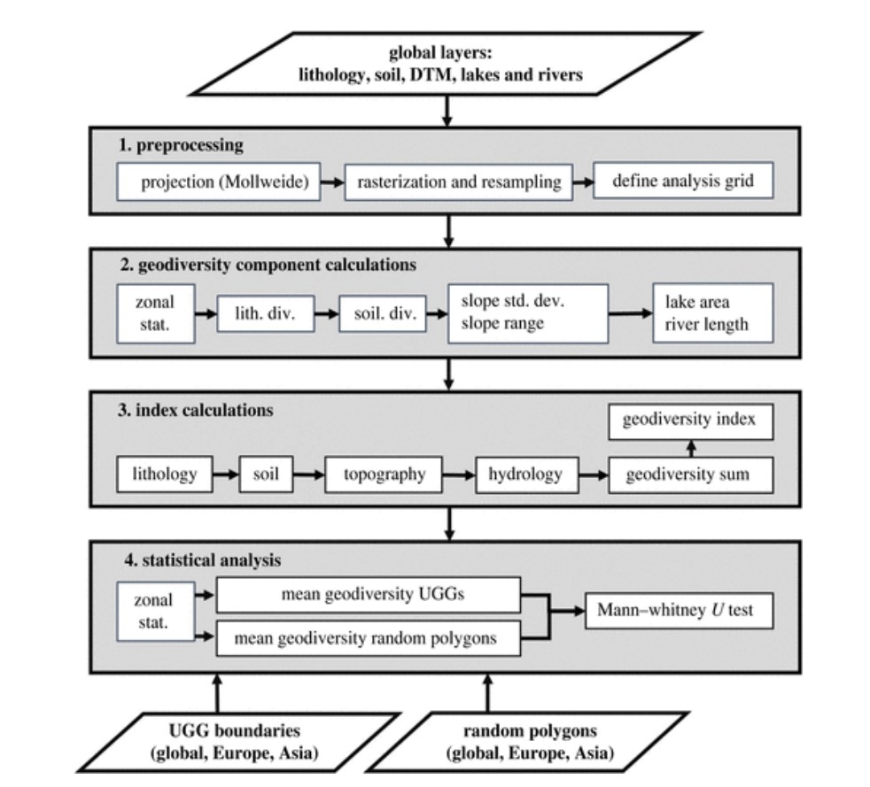

# Geodiversity

<br />

Geodiversity refers to the natural variety of abiotic features within a given area. This includes the diversity of rocks, minerals, water, landforms, and soils as well as the physical processes that shape them. Geodiversity is an integral aspect of the Earth's natural heritage and it can be hypothesized that geodiversity supports biodiversity by providing a variety of physical environments in which different organisms can thrive. The relationship between geodiversity and its role in ecosystems can be summarized to:

> Geodiversity focuses on the resource giving potential of components of the geosphere in terms of their overall resource potential, the temporal variation in resource availability and the variation of resource availability over space.

<br />

It would therefore be interesting to investigate the connection between patterns in biodiversity and geodiversity. In order to explore this relationship, we first have to create a geodiversity map. During the lecture, you have seen how geodiversity can be calculated from its components and you were presented by the following workflow:

<br />
<br />

<div align="center">
  
  <br />
  <em>Figure 1. Example workflow to calculate geodiversity as done by Polman et al, 2024.</em>
</div>

<br />

We are going to replicate most of the steps performed in this workflow from the paper in Google Earth Engine! You will compute a geodiversity map of the world using standardized and harmonized environmental datasets. First of all, we need a clear understanding of the components we'll use. We will create this geodiversity index by combining geological, soil, hydrological, and topographical datasets within grid cells of 10 × 10 km. These datasets are:
- A geological dataset derived from the Global Lithological Map database [Hartmann & Moosdorf, 2012](https://doi.pangaea.de/10.1594/PANGAEA.788537) is used to compute a lithological index, based on the number of the lithological formations in each grid cell.
- A soil index for each grid cell based on the number of soil types was derived from the SoilGrids repository [Hengl et al., 2017](https://soilgrids.org/).
- For the hydrological index the total river length per grid cell was calculated using the data from [Lehner, Verdin, & Jarvis, 2011](https://agupubs.onlinelibrary.wiley.com/doi/10.1029/2008EO100001).
- The slope index was based on a Digital Elevation Model elevation database [Yamazaki et al., 2017](https://hydro.iis.u-tokyo.ac.jp/~yamadai/MERIT_DEM/) and shows the standard deviation of the slope for each grid cell. 

<br />

Let's import these preprocessed global datasets in order to compute the geodiversity index. Similarly as the as for the biodiversity maps, go to the *Assets* tab in GEE and import the raster (TIF) files of the slope, river, soil & lithology maps one by one. While Google Earth Engine is processing this data, you can already glimpse over the following questions:

<br />

> 📝 **Question 1**. What are the five components of geodiversity according to Tukiainen, Toivanen & Maliniemi, 2023?

> 📝 **Question 2**. Polman et al. (2024) harmonized four open-access global layers reflecting lithology, soil, terrain, rivers and lakes. Why did they not use a geomorphological map in their assessment?

> 📝 **Question 3**. Seijmonsbergen et al. (2018 & see lecture on geodiversity) introduce **time** as a key factor in their study on the geodiversity of the Hawaiian Archipelago. In which component(s) of geodiversity is time a key factor?
> <br />
> • In soil and geology only <br />
> • In geomorphology and soil only <br />
> • In geology and geomorphology and soil <br />
> • In all components of geodiversity <br />

***

<br />

### Computing the geodiversity index

Now that you uploaded the four rasters to GEE, make sure to rename them at the top of your screen in the middle panel to avoid confusion between the *"images"*. The names that will be used in the provided code will be *soildiv*, *lithdiv*, *riverdiv* & *slopediv*, to indicate the diversity map of that component respectively. Therefore, use these names if you want the code running smoothly on the provided code.

Last but not least, we need to import the last dataset in your zipfile called *"world_countries_generalized"*. These are polygons of the border for every country on earth that we are going to use later on. This is a shapefile, so when adding this asset, press the *Table upload* > *Shape files* and select the files in the folder. When the dataset is added to GEE, rename this to *countries*.

Before we can use the different components to calculate geodiversity, we need to reclassify the data to ensure that each component is weighted equally. This reclassification is done based on equal data partitioning. The first 20% of the data will be reclassified into the lowest category (value = 1), the next 20% into the second-lowest category (value = 2), and so on, until the top 20% of the data is classified into the highest category (value = 5). By reclassifying the data in this manner, we create a standardized basis for integrating the various datasets into a comprehensive geodiversity index. This ensures that no single component disproportionately influences the final index, allowing for a balanced representation of geological, soil, hydrological, and topographical diversity within the grid cells. Fortunately for us, GEE can calculate the exact breaks for the 20%-percentiles for each raster, do so with the following code (it might take a while to run, as it performs calculations for every raster over the **Entire!** world).

**Note: You are not expected to produce this piece of code or understand the exact function of every line, more so the general idea of what this code does**
```javascript
// Create world polygon and add the polygon to the map
var mergedPolygon = countries.union();

Map.addLayer(mergedPolygon, {color: 'FF0000'}, 'World polygon');


// Calculate the 20, 40, 60 and 80th percentile of slope values over the Whole World
var breaks_slope = slopediv.reduceRegion({
  reducer: ee.Reducer.percentile([20, 40, 60, 80]),
  geometry: mergedPolygon,
  scale: 10000
});

// Print the percentile breaking values to the Console
print('Slope breaks:', breaks_slope);

// Get the dictionary keys as a list
var slope_keys = breaks_slope.keys();

// Reclassify slope map
var slopeclass = slopediv
                .where(slopediv.lte(ee.Number(breaks_slope.get(slope_keys.get(0)))), 1)  // Class 1: slopediv values <= 20th percentile
                .where(slopediv.gt(ee.Number(breaks_slope.get(slope_keys.get(0)))).and(slopediv.lte(ee.Number(breaks_slope.get(slope_keys.get(1))))), 2)  // Class 2: 20th < slopediv values <= 40th percentile
                .where(slopediv.gt(ee.Number(breaks_slope.get(slope_keys.get(1)))).and(slopediv.lte(ee.Number(breaks_slope.get(slope_keys.get(2))))), 3)  // Class 3: 40th < slopediv values <= 60th percentile
                .where(slopediv.gt(ee.Number(breaks_slope.get(slope_keys.get(2)))).and(slopediv.lte(ee.Number(breaks_slope.get(slope_keys.get(3))))), 4)  // Class 4: 60th < slopediv values <= 80th percentile
                .where(slopediv.gt(ee.Number(breaks_slope.get(slope_keys.get(3)))), 5);  // Class 5: slopediv values > 80th percentile

Map.addLayer(slopeclass, {min: 1, max: 5, palette: ['red', 'orange', 'yellow', 'green', 'darkgreen']}, 'Slope map');


// Calculate the 20, 40, 60 and 80th percentile of soil values over the Whole World
var breaks_soil = soildiv.reduceRegion({
  reducer: ee.Reducer.percentile([20, 40, 60, 80]),
  geometry: mergedPolygon,
  scale: 10000
});

// Print the percentile breaking values to the Console
print('Soil breaks:', breaks_soil);

// Get the dictionary keys as a list
var soil_keys = breaks_soil.keys();

// Reclassify soil map
var soilclass = soildiv
                .where(soildiv.lte(ee.Number(breaks_soil.get(soil_keys.get(0)))), 1)  // Class 1: soildiv values <= 20th percentile
                .where(soildiv.gt(ee.Number(breaks_soil.get(soil_keys.get(0)))).and(soildiv.lte(ee.Number(breaks_soil.get(soil_keys.get(1))))), 2)  // Class 2: 20th < soildiv values <= 40th percentile
                .where(soildiv.gt(ee.Number(breaks_soil.get(soil_keys.get(1)))).and(soildiv.lte(ee.Number(breaks_soil.get(soil_keys.get(2))))), 3)  // Class 3: 40th < soildiv values <= 60th percentile
                .where(soildiv.gt(ee.Number(breaks_soil.get(soil_keys.get(2)))).and(soildiv.lte(ee.Number(breaks_soil.get(soil_keys.get(3))))), 4)  // Class 4: 60th < soildiv values <= 80th percentile
                .where(soildiv.gt(ee.Number(breaks_soil.get(soil_keys.get(3)))), 5);  // Class 5: soildiv values > 80th percentile

Map.addLayer(soilclass, {min: 1, max: 5, palette: ['red', 'orange', 'yellow', 'green', 'darkgreen']}, 'Soil map');


// Calculate the 20, 40, 60 and 80th percentile of riverlength values over the Whole World
var breaks_river = riverdiv.reduceRegion({
  reducer: ee.Reducer.percentile([20, 40, 60, 80]),
  geometry: mergedPolygon,
  scale: 10000
});

// Print the percentile breaking values to the Console
print('River breaks:', breaks_river);

// Get the dictionary keys as a list
var river_keys = breaks_river.keys();

// Reclassify river map
var riverclass = riverdiv
                .where(riverdiv.lte(ee.Number(breaks_river.get(river_keys.get(0)))), 1)  // Class 1: riverdiv values <= 20th percentile
                .where(riverdiv.gt(ee.Number(breaks_river.get(river_keys.get(0)))).and(riverdiv.lte(ee.Number(breaks_river.get(river_keys.get(1))))), 2)  // Class 2: 20th < riverdiv values <= 40th percentile
                .where(riverdiv.gt(ee.Number(breaks_river.get(river_keys.get(1)))).and(riverdiv.lte(ee.Number(breaks_river.get(river_keys.get(2))))), 3)  // Class 3: 40th < riverdiv values <= 60th percentile
                .where(riverdiv.gt(ee.Number(breaks_river.get(river_keys.get(2)))).and(riverdiv.lte(ee.Number(breaks_river.get(river_keys.get(3))))), 4)  // Class 4: 60th < riverdiv values <= 80th percentile
                .where(riverdiv.gt(ee.Number(breaks_river.get(river_keys.get(3)))), 5);  // Class 5: riverdiv values > 80th percentile

Map.addLayer(riverclass, {min: 1, max: 5, palette: ['red', 'orange', 'yellow', 'green', 'darkgreen']}, 'River map');


// Calculate the 20, 40, 60 and 80th percentile of lithology values over the Whole World
var breaks_lith = lithdiv.reduceRegion({
  reducer: ee.Reducer.percentile([20, 40, 60, 80]),
  geometry: mergedPolygon,
  scale: 10000
});

// Print the percentile breaking values to the Console
print('Lithology breaks:', breaks_lith);

// Get the dictionary keys as a list
var lith_keys = breaks_lith.keys();

// Reclassify the lithology map
var lithclass = lithdiv
                .where(lithdiv.lte(ee.Number(breaks_lith.get(lith_keys.get(0)))), 1)  // Class 1: lithdiv values <= 20th percentile
                .where(lithdiv.gt(ee.Number(breaks_lith.get(lith_keys.get(0)))).and(lithdiv.lte(ee.Number(breaks_lith.get(lith_keys.get(1))))), 2)  // Class 2: 20th < lithdiv values <= 40th percentile
                .where(lithdiv.gt(ee.Number(breaks_lith.get(lith_keys.get(1)))).and(lithdiv.lte(ee.Number(breaks_lith.get(lith_keys.get(2))))), 3)  // Class 3: 40th < lithdiv values <= 60th percentile
                .where(lithdiv.gt(ee.Number(breaks_lith.get(lith_keys.get(2)))).and(lithdiv.lte(ee.Number(breaks_lith.get(lith_keys.get(3))))), 4)  // Class 4: 60th < lithdiv values <= 80th percentile
                .where(lithdiv.gt(ee.Number(breaks_lith.get(lith_keys.get(3)))), 5);  // Class 5: lithdiv values > 80th percentile

Map.addLayer(lithclass, {min: 1, max: 5, palette: ['red', 'orange', 'yellow', 'green', 'darkgreen']}, 'Lith map');
```

<br />

Did it work? Then give your laptop a big hug, it did some crazy work for you just now, you just processed the world four times over in a matter of minutes.. wow. The drawback is, it will do this all the time when you press run, so keep that in mind.

Now that we have the reclassified environmental components, we can calculate the geodiversity map by simply adding them together. Replace the two question marks, *"?"*, in the following code by the two missing reclassified component maps.


```javascript
// Combine all metrics to calculate a geodiversity index
var geodiv = slopeclass
  .add(lithclass)
  .add(?)
  .add(?);

// Visualize the geodiversity, why is the minimum value 4 and the maximum value 20?
Map.addLayer(geodiv, { min: 4, max: 20, palette: ['red', 'orange', 'yellow', 'green', 'darkgreen']}, 'Geodiversity map');
```

<br />

> 🔍 **Review 2**. How does the geodiversity correspond to the biodiversity metrics richness and rarity? <br />

<br />
<details>
<summary>Answer Review . (click on this to show/hide the answer)</summary>
It seems that the geodiversity map corresponds more to the species rarity than the species richness.
</details>
<br />


> 📝 **Question 4**. Which of the following statements are true?
> <br />
> • The Amazonian Lowland in Ecuador and the Wilhelmina Mountains in Surinam have the highest geodiversity classes <br />
> • The lowlands and mountains in Surinam and Ecuador have relatively high geodiversity <br />
> • The lowlands and mountains in Surinam and Ecuador have predominantly moderate geodiversity <br />
> • The mountains in Ecuador and in Surinam have higher geodiversity classes than their lowlands <br />

> 📝 **Question 5**. Take a look at both the Western USA as well as Europe, why is the species richness in Europe on a comparable latitude way lower than in the Western USA, despite having similar geodiversity values?
> Hint: Think back of earlier lectures for this course.

> 📝 **Question 6**. Study the geodiversity map of Niger. it is characterized by the very low and low geodiversity classes, probably related to the absence of surface water in combination with large plains, without too much topographical variation. Soil formation, in the absence of vegetation and water, will likely be restricted as well.
> <br />
> • Karst processes and fluvial processes
> • Weathering processes and mass movement <br />
> • Aeolian processes and weathering processes <br />
> • Fluvial processes and mass movement processes <br />

***

<br />

It is nice to observe the patterns between biodiversity and geodiversity, yet it is clear that they do not overlap fully. There are, of course, other relevant factors to consider when investigating biodiversity. One such factor is climate data, which, as you learned in the lecture, has a complex relationship with biodiversity. Let's import the annual precipitation and mean temperature as well. We can use the BioCLIM dataset which you are familier with:

```javascript
// Add climate data - annual mean temperature and yearly precipitation
var dataset = ee.Image('WORLDCLIM/V1/BIO');
var anntemp = dataset.select('bio01').multiply(0.1);
var visParamsTemp = {
  min: -23,
  max: 30,
  palette: ['blue', 'purple', 'cyan', 'green', 'yellow', 'red'],
};
Map.addLayer(anntemp, visParamsTemp, 'Annual Mean Temperature');

var annprec = dataset.select('bio12');
var visParamsPrec = {
  min: 0,
  max: 11000,
  palette: ['blue', 'purple', 'cyan', 'green', 'yellow', 'red'],
};
Map.addLayer(annprec, visParamsPrec, 'Annual Precipitation');
```

<br />

We are now observing these patterns spatially, but it would be cool if we can investigate this relationship statistically. Therefore we need to analyze data in Rstudio. A neat way to do this is to scatter some random points over the earth and collect the biodiversity, geodiversity and climate data for those points. The following code will generate random points over the earth within the specified *countries* polygon, such that no point will end up in the ocean for instance. Then, we can reduce the data to the points as we did in earlier practicals. Make sure to export all the data to your google drive, download it and import the csv files in Rstudio.

```javascript
// Generate 100 random points on our beautiful planet earth.
var randomPoints = ee.FeatureCollection.randomPoints(
    {region: mergedPolygon, points: 100, seed: 0, maxError: 1});

print('Random points from within the defined region', randomPoints);
Map.addLayer(randomPoints, {color: 'purple'}, 'Random points');

// GREAT! now we can simply extract the values of geodiversity for the different points and export it to a csv: 
var points_geo = geodiv.reduceRegions(randomPoints, ee.Reducer.mean( ), 10000); // The lowest resolution of our datasets is 10 sq.km, therefore we reduce the data to this distance
Export.table.toDrive({
  collection: points_geo,
  description:'points_geo',
  fileFormat: 'CSV'
}); 

// biodiversity exports
var points_rich = richall.reduceRegions(randomPoints, ee.Reducer.mean( ), 10000); // the '10' here indicates the resolution at which you want to collect the data, i.e. in this case the resolution of the dem , in this case 90m
Export.table.toDrive({
  collection: points_rich,
  description:'points_rich',
  fileFormat: 'CSV'
}); 

var points_rare = rareall.reduceRegions(randomPoints, ee.Reducer.mean( ), 10000); // the '10' here indicates the resolution at which you want to collect the data, i.e. in this case the resolution of the dem , in this case 90m
Export.table.toDrive({
  collection: points_rare,
  description:'points_rare',
  fileFormat: 'CSV'
}); 

// also for temperature and precipitation
var points_temp = anntemp.reduceRegions(randomPoints, ee.Reducer.mean( ), 10000); // the '10' here indicates the resolution at which you want to collect the data, i.e. in this case the resolution of the dem , in this case 90m
Export.table.toDrive({
  collection: points_temp,
  description:'points_temp',
  fileFormat: 'CSV'
}); 

var points_prec = annprec.reduceRegions(randomPoints, ee.Reducer.mean( ), 10000); // the '10' here indicates the resolution at which you want to collect the data, i.e. in this case the resolution of the dem , in this case 90m
Export.table.toDrive({
  collection: points_prec,
  description:'points_prec',
  fileFormat: 'CSV'
}); 
```


<br />
<br />

**Now we are ready for the [next step](relationship.html): investigating these relationships in R**

<nav>
  <ul>
    <li><a href="intro.html">Step 1: Problem Description</a></li>
    <li><strong>Step 2: Geodiversity</strong></li>
    <li><a href="relationship.html">Step 3: Data Analysis</a></li>
    <li><a href="../"><b>Back to Overview Page</b></a></li>
  </ul>
</nav>

