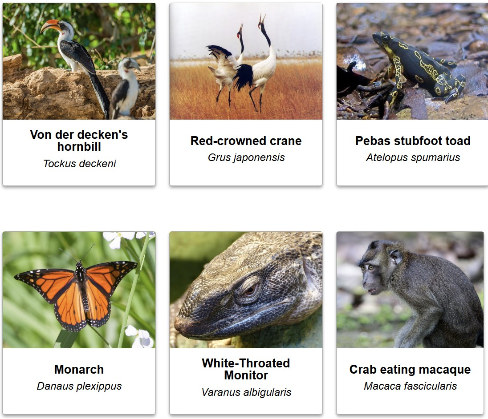

# Welcome to the 4th practical. 

In this practical we will look at the amazing patterns and relationships between our abiotic and biotic world. We will use geodiversity as a composite measure for our abiotic world, which includes the variety of physical and chemical features of the Earth's surface. In addition, we will also take climate data into consideration during the analysis. For our biotic world, we will focus on the richness and rarity of species, encompassing both the diversity and uniqueness of life forms present in an ecosystem. The research question for this practical is:
- How do global trends in biodiversity differ over abiotic gradients on a landscape level?

Let's delve into the interactions between these two realms, start by creating a new script in Google Earth Engine: Click on *NEW* at the top-left of GEE and choose *file*, give it an appropriate name like: *prac4_geodiversity*.

<br />

## Step 1: Describing data

<br />

### Problem setting


<br />

How would you go about analysing biodiversity on this global scale given the information above? Can you complete the following table and give the answers on the question marks?

| Parameter  |  Value |
|---|---|
| Spatial extent | ? |
| Temporal extent | Static analysis. We are conducting an analysis on current (climatic) data. |
| Cartographic unit |  ?  |
| Dimensions | Biodiversity, geodiversity, climate |
| Dimension description |  Biodiversity is expressed in richness & rarity. Geodiversity consists of slope, hydrology, soil and lithology maps. For climate data we will use annual precipitation and mean temperature. |
| Temporal resolution | ? |
| Spatial resolution | ? |
| Assumption / Hypothesis | ? |

<br />

*** 

<br />

### Accessing the data

The data for this practical has already been preprocessed, so you only need to upload it to Google Earth Engine and perform the analysis. You can find the data in the .zip file provided on Canvas for this tutorial. Once you have downloaded the data, moved it to a desired folder and unzipped it there you are good to go.

<br />

### Biodiversity

You have seen multiple ways of calculating biodiversity in the lectures. One of those is to calculate the species richness, often defined as the number of species in a region. Another way might be to calculate the rarity of a species. This is somewhat harder to define, but says how common it is to observe a species. One way of calculating species rarity is by dividing the species occurence in an area by the total amount of area where this species is present. 

Today we will use the biodiversity metrics provided by the [Map of life](https://mol.org/). This website uses the latest approaches and technologies to deliver detailed information on the distribution of species and their change. In Map of Life, the species richness is estimated by summing the predicted presence of all studied species. Rarity maps are similarly summed, but each species presence in a cell is weighted by the total number of positive cells in the study area for that species. The all-taxa richness and rarity layers are averaged over the normalized richness & rarity of all 7 taxonomic groups. 

<br />

<div align="center">
  
  <br />
  <em>Figure 1. A random selection of species in the Map of Life database.</em>
</div>

<br />

Let's examine how biodiversity, measured in terms of richness and rarity, varies across different regions of the world. To begin, we need to load the required data into Google Earth Engine (GEE) by creating new assets. You have loaded data into GEE before, so this will not be new for you, perform these same steps as you did in earlier practicals:
- Click on the *“Assets”* tab on the top-left panel.
- Press the *“New”* button to create a new asset.
- Select *“GeoTIFF”* under Image upload.
- Select the *"richall"* dataset from the data that you downloaded, perform previous steps again to also upload the *"rareall"*  dataset.

The biodiversity datasets will be visible under the tab *"Tasks"* in the top-right panel of GEE.
- Click on the newly created assets and tap the *"View asset"* button.
- Press on *"Import"* in the popup.
- The datasets will be visible in the middle panel on GEE, give it the appropriate names *"richall"* and *"rareall"* respectively.

<br />

Well done! You've successfully loaded the biodiversity data into GEE. If you used the suggested names for the imported data, you can visualize the richness and rarity of all species with the following code. Note that a mask is applied to remove all NoData values from the map, ensuring that the oceans are not colored.

```javascript
// Define NoData value (0 in this example)
var nodataValue = 0;

// Create a mask for NoData
var raremask = rareall.updateMask(rareall.neq(nodataValue));
var richmask = richall.updateMask(richall.neq(nodataValue));

// visualize biodiversity maps
Map.addLayer(richmask, { min: 0, max: 100, palette: ['red', 'yellow', 'green']}, 'richness');
Map.addLayer(raremask, { min: 0, max: 100, palette: ['red', 'yellow', 'green']}, 'rarity');

Map.centerObject(richmask, 2);
```

<br />

As you can see in the code and if you inspect the map, the values for both richness and rarity range from 0 to 100. This is because the values are normalized: a score of 100 represents the maximum value for richness or rarity, while a score of 0 represents the minimum.

<br />

> 🔍 **Review 1**. At first glance, what stands out to you about and between the richness and rarity maps? <br />

<br />
<details>
<summary>Answer Review 1. (click on this to show/hide the answer)</summary>
There can be many right answers to this question. Some striking patterns include the high amount of species richness in the tropics. Yet, these biomes do not always show high species rarity. Instead, species rarity is more pronounced on islands and in mountainous areas.
</details>
<br />


### Geodiversity
Geodiversity refers to the natural variety of abiotic features within a given area. This includes the diversity of rocks, minerals, water, landforms, and soils as well as the physical processes that shape them. Geodiversity is an integral aspect of the Earth's natural heritage and it can be hypothesized that geodiversity supports biodiversity by providing a variety of physical environments in which different organisms can thrive. The relationship between geodiversity and its role in ecosystems can be summarized to:

> Geodiversity focuses on the resource giving potential of components of the geosphere in terms of their overall resource potential, the temporal variation in resource availability and the variation of resource availability over space.

It would therefore be interesting to investigate the connection between patterns in biodiversity and geodiversity. In order to explore this relationship, we first have to create a geodiversity map. During the lecture, you have seen how geodiversity can be calculated from its components and you were presented by the following workflow:

<br />

<div align="center">
  
  <br />
  <em>Figure 1. Example workflow to calculate geodiversity as done by Polman et al, 2024.</em>
</div>

<br />

We are going to replicate most of the steps performed in this workflow from the paper in Google Earth Engine! You will compute a geodiversity map of the world using standardized and harmonized environmental datasets. First of all, we need a clear understanding of the components we'll use. We will create this geodiversity index by combining geological, soil, hydrological, and topographical datasets within grid cells of 10 × 10 km. A geological dataset derived from the Global Lithological Map database [Hartmann & Moosdorf, 2012](https://doi.pangaea.de/10.1594/PANGAEA.788537) is used to compute a lithological index, based on the number of the lithological formations in each grid cell. A soil index for each grid cell based on the number of soil types was derived from the SoilGrids repository [Hengl et al., 2017](https://soilgrids.org/).  For the hydrological index the total river length per grid cell was calculated using the data from [Lehner, Verdin, & Jarvis, 2011](https://agupubs.onlinelibrary.wiley.com/doi/10.1029/2008EO100001). The slope index was based on a Digital Elevation Model elevation database [Yamazaki et al., 2017](https://hydro.iis.u-tokyo.ac.jp/~yamadai/MERIT_DEM/) and shows the standard deviation of the slope for each grid cell. 

<br />

Let's import these preprocessed global datasets in order to compute the geodiversity index. Similarly as the as for the biodiversity maps, go to the *Assets* tab in GEE and import the raster (TIF) files of the slope, river, soil & lithology maps one by one. While Google Earth Engine is processing this data, you can already glimpse over the following questions:

<br />

> 📝 **Question 1**. What are the five components of geodiversity according to Tukiainen, Toivanen1 & Maliniemi1, 2023?

> 📝 **Question 2**. Polman et al. (2024) harmonized four open-access global layers reflecting lithology, soil, terrain, rivers and lakes. Why did they not use a geomorphological map in their assessment?

> 📝 **Question 3**. Seijmonsbergen et al. (2018 & see lecture on geodiversity) introduce **time** as a key factor in their study on the geodiversity of the Hawaiian Archipelago. In which component(s) of geodiversity is time a key factor?
> <br />
> • In soil and geology only <br />
> • In geomorphology and soil only <br />
> • In geology and geomorphology and soil <br />
> • In all components of geodiversity <br />

***

<br />

### Computing the geodiversity index

Now that you uploaded the four rasters to GEE, make sure to rename them at the top of your screen in the middle panel to avoid confusion between the *"images"*. The names that will be used in the provided code will be *soildiv*, *lithdiv*, *riverdiv* & *slopediv*, to indicate the diversity map of that component respectively. Therefore, use these names if you want the code running smoothly on the provided code.

Last but not least, we need to import the last dataset in your zipfile called *"world_countries_generalized"*. These are polygons of the border for every country on earth that we are going to use later on. This is a shapefile, so when adding this asset, press the *Table upload* > *Shape files* and select the files in the folder. When the dataset is added to GEE, rename this to *countries*.

Before we can use the different components to calculate geodiversity, we need to reclassify the data to ensure that each component is weighted equally. This reclassification is done based on equal data partitioning. The first 20% of the data will be reclassified into the lowest category (value = 1), the next 20% into the second-lowest category (value = 2), and so on, until the top 20% of the data is classified into the highest category (value = 5). By reclassifying the data in this manner, we create a standardized basis for integrating the various datasets into a comprehensive geodiversity index. This ensures that no single component disproportionately influences the final index, allowing for a balanced representation of geological, soil, hydrological, and topographical diversity within the grid cells. Fortunately for us, GEE can calculate the exact breaks for the 20%-percentiles for each raster, do so with the following code (it might take a while to run, as it performs calculations for every raster over the **Entire!** world).

**Note: You are not expected to produce this piece of code or understand the exact function of every line, more so the general idea of what this code does**
```javascript
// Create world polygon and add the polygon to the map
var mergedPolygon = countries.union();

Map.addLayer(mergedPolygon, {color: 'FF0000'}, 'World polygon');


// Calculate the 20, 40, 60 and 80th percentile of slope values over the Whole World
var breaks_slope = slopediv.reduceRegion({
  reducer: ee.Reducer.percentile([20, 40, 60, 80]),
  geometry: mergedPolygon,
  scale: 10000
});

// Print the percentile breaking values to the Console
print('Slope breaks:', breaks_slope);

// Get the dictionary keys as a list
var slope_keys = breaks_slope.keys();

// Reclassify slope map
var slopeclass = slopediv
                .where(slopediv.lte(ee.Number(breaks_slope.get(slope_keys.get(0)))), 1)  // Class 1: slopediv values <= 20th percentile
                .where(slopediv.gt(ee.Number(breaks_slope.get(slope_keys.get(0)))).and(slopediv.lte(ee.Number(breaks_slope.get(slope_keys.get(1))))), 2)  // Class 2: 20th < slopediv values <= 40th percentile
                .where(slopediv.gt(ee.Number(breaks_slope.get(slope_keys.get(1)))).and(slopediv.lte(ee.Number(breaks_slope.get(slope_keys.get(2))))), 3)  // Class 3: 40th < slopediv values <= 60th percentile
                .where(slopediv.gt(ee.Number(breaks_slope.get(slope_keys.get(2)))).and(slopediv.lte(ee.Number(breaks_slope.get(slope_keys.get(3))))), 4)  // Class 4: 60th < slopediv values <= 80th percentile
                .where(slopediv.gt(ee.Number(breaks_slope.get(slope_keys.get(3)))), 5);  // Class 5: slopediv values > 80th percentile

Map.addLayer(slopeclass, {min: 1, max: 5, palette: ['red', 'orange', 'yellow', 'green', 'darkgreen']}, 'Slope map');


// Calculate the 20, 40, 60 and 80th percentile of soil values over the Whole World
var breaks_soil = soildiv.reduceRegion({
  reducer: ee.Reducer.percentile([20, 40, 60, 80]),
  geometry: mergedPolygon,
  scale: 10000
});

// Print the percentile breaking values to the Console
print('Soil breaks:', breaks_soil);

// Get the dictionary keys as a list
var soil_keys = breaks_soil.keys();

// Reclassify soil map
var soilclass = soildiv
                .where(soildiv.lte(ee.Number(breaks_soil.get(soil_keys.get(0)))), 1)  // Class 1: soildiv values <= 20th percentile
                .where(soildiv.gt(ee.Number(breaks_soil.get(soil_keys.get(0)))).and(soildiv.lte(ee.Number(breaks_soil.get(soil_keys.get(1))))), 2)  // Class 2: 20th < soildiv values <= 40th percentile
                .where(soildiv.gt(ee.Number(breaks_soil.get(soil_keys.get(1)))).and(soildiv.lte(ee.Number(breaks_soil.get(soil_keys.get(2))))), 3)  // Class 3: 40th < soildiv values <= 60th percentile
                .where(soildiv.gt(ee.Number(breaks_soil.get(soil_keys.get(2)))).and(soildiv.lte(ee.Number(breaks_soil.get(soil_keys.get(3))))), 4)  // Class 4: 60th < soildiv values <= 80th percentile
                .where(soildiv.gt(ee.Number(breaks_soil.get(soil_keys.get(3)))), 5);  // Class 5: soildiv values > 80th percentile

Map.addLayer(soilclass, {min: 1, max: 5, palette: ['red', 'orange', 'yellow', 'green', 'darkgreen']}, 'Soil map');


// Calculate the 20, 40, 60 and 80th percentile of riverlength values over the Whole World
var breaks_river = riverdiv.reduceRegion({
  reducer: ee.Reducer.percentile([20, 40, 60, 80]),
  geometry: mergedPolygon,
  scale: 10000
});

// Print the percentile breaking values to the Console
print('River breaks:', breaks_river);

// Get the dictionary keys as a list
var river_keys = breaks_river.keys();

// Reclassify river map
var riverclass = riverdiv
                .where(riverdiv.lte(ee.Number(breaks_river.get(river_keys.get(0)))), 1)  // Class 1: riverdiv values <= 20th percentile
                .where(riverdiv.gt(ee.Number(breaks_river.get(river_keys.get(0)))).and(riverdiv.lte(ee.Number(breaks_river.get(river_keys.get(1))))), 2)  // Class 2: 20th < riverdiv values <= 40th percentile
                .where(riverdiv.gt(ee.Number(breaks_river.get(river_keys.get(1)))).and(riverdiv.lte(ee.Number(breaks_river.get(river_keys.get(2))))), 3)  // Class 3: 40th < riverdiv values <= 60th percentile
                .where(riverdiv.gt(ee.Number(breaks_river.get(river_keys.get(2)))).and(riverdiv.lte(ee.Number(breaks_river.get(river_keys.get(3))))), 4)  // Class 4: 60th < riverdiv values <= 80th percentile
                .where(riverdiv.gt(ee.Number(breaks_river.get(river_keys.get(3)))), 5);  // Class 5: riverdiv values > 80th percentile

Map.addLayer(riverclass, {min: 1, max: 5, palette: ['red', 'orange', 'yellow', 'green', 'darkgreen']}, 'River map');


// Calculate the 20, 40, 60 and 80th percentile of lithology values over the Whole World
var breaks_lith = lithdiv.reduceRegion({
  reducer: ee.Reducer.percentile([20, 40, 60, 80]),
  geometry: mergedPolygon,
  scale: 10000
});

// Print the percentile breaking values to the Console
print('Lithology breaks:', breaks_lith);

// Get the dictionary keys as a list
var lith_keys = breaks_lith.keys();

// Reclassify the lithology map
var lithclass = lithdiv
                .where(lithdiv.lte(ee.Number(breaks_lith.get(lith_keys.get(0)))), 1)  // Class 1: lithdiv values <= 20th percentile
                .where(lithdiv.gt(ee.Number(breaks_lith.get(lith_keys.get(0)))).and(lithdiv.lte(ee.Number(breaks_lith.get(lith_keys.get(1))))), 2)  // Class 2: 20th < lithdiv values <= 40th percentile
                .where(lithdiv.gt(ee.Number(breaks_lith.get(lith_keys.get(1)))).and(lithdiv.lte(ee.Number(breaks_lith.get(lith_keys.get(2))))), 3)  // Class 3: 40th < lithdiv values <= 60th percentile
                .where(lithdiv.gt(ee.Number(breaks_lith.get(lith_keys.get(2)))).and(lithdiv.lte(ee.Number(breaks_lith.get(lith_keys.get(3))))), 4)  // Class 4: 60th < lithdiv values <= 80th percentile
                .where(lithdiv.gt(ee.Number(breaks_lith.get(lith_keys.get(3)))), 5);  // Class 5: lithdiv values > 80th percentile

Map.addLayer(lithclass, {min: 1, max: 5, palette: ['red', 'orange', 'yellow', 'green', 'darkgreen']}, 'Lith map');
```

<br />

Did it work? Then give your laptop a big hug, it did some crazy work for you just now, you just processed the world four times over in a matter of minutes.. wow. The drawback is, it will do this all the time when you press run, so keep that in mind.

Now that we have the reclassified environmental components, we can calculate the geodiversity map by simply adding them together. Replace the two question marks, *"?"*, in the following code by the two missing reclassified component maps.


```javascript
// Combine all metrics to calculate a geodiversity index
var geodiv = slopeclass
  .add(lithclass)
  .add(?)
  .add(?);

// Visualize the geodiversity, why is the minimum value 4 and the maximum value 20?
Map.addLayer(geodiv, { min: 4, max: 20, palette: ['red', 'orange', 'yellow', 'green', 'darkgreen']}, 'Geodiversity map');
```

<br />

> 🔍 **Review 2**. W <br />

<br />
<details>
<summary>Answer Review . (click on this to show/hide the answer)</summary>

</details>
<br />


> 📝 **Question 4**. Which of the following statements are true?
> <br />
> • The Amazonian Lowland in Ecuador and the Wilhelmina Mountains in Surinam have the highest geodiversity classes <br />
> • The lowlands and mountains in Surinam and Ecuador have relatively high geodiversity <br />
> • The lowlands and mountains in Surinam and Ecuador have predominantly moderate geodiversity <br />
> • The mountains in Ecuador and in Surinam have higher geodiversity classes than their lowlands <br />

> 📝 **Question 5**. Take a look at both the Western USA as well as Europe, why is the species richness in Europe on a comparable latitude way lower than in the Western USA, despite having similar geodiversity values?
> Hint: Think back of earlier lectures for this course.

> 📝 **Question 6**. Study the geodiversity map of Niger. it is characterized by the very low and low geodiversity classes, probably related to the absence of surface water in combination with large plains, without too much topographical variation. Soil formation, in the absence of vegetation and water, will likely be restricted as well.
> <br />
> • Karst processes and fluvial processes
> • Weathering processes and mass movement <br />
> • Aeolian processes and weathering processes <br />
> • Fluvial processes and mass movement processes <br />

<br />


The Boreal forest, which can also occur in high mountains, is dominated by conifer trees. Go to the map of life https://mol.orgLinks to an external site.
Select patterns, species richness and rarity, and go to the species groep conifers. You can see that conifer diversity is higher on the west coast of the USA than in the mountains of Switzerland. Why is this?
the area in the USA is drier
The mountains are higher in the USA
the soils are volcanic in the USA
because the mountains in the USA are located Nort-South


We have processed the camera trap data, so that it is compiled into a shape-file that you can download from canvas: download and unzip the file (CAMERAS.zip) in your working directory. 

Then you can load the shapefile into google earth engine so that you can do analysis with/on it: 

<video style="width:100%" controls>
  <source src="https://user-images.githubusercontent.com/89069805/179978055-1c284a74-4951-41b8-83f5-b790c58c450c.mp4" type="video/mp4">
Your browser does not support the video tag.
</video>

<br />

Now it needs a few minutes to load (you can check the progress in the right panel 'tasks'). 

Once it is finished, we can load it and visualize it on the map. We will also draw a square around it which will be useful to calculate the NDVI. Loading the camera points and drawing the region of interest around them is shown here: 


<video style="width:100%" controls>
  <source src="https://user-images.githubusercontent.com/89069805/179978970-7b2b90c7-3ac5-402a-ac69-7da81db11365.mp4" type="video/mp4">
Your browser does not support the video tag.
</video>

> 📝 **Question 1**. The data we use of the camera traps is basically:
> <br />
> • Abundance data<br />
> • Species richness data, without consideration of abundance <br />
> • A weighted combination of abundance and species richness <br />

***

<br />

**NDVI-Map:** <br />
The camera traps are relatively close together, the NDVI datasets that are readily available in the Google Earth Catalogue have a rough spatial resolution (e.g. the based on [MODIS satellites has a 500m resolution](https://developers.google.com/earth-engine/datasets/catalog/MODIS_061_MOD13A1). 

> 🔍 **Review 1**. Why would a readily available NDVI with a resolution of 500m be too rough? <br />

<br />
<details>
<summary>Answer Review 1. (click on this to show/hide the answer)</summary>
Because many camera traps would then fall within the same rastercell of the NDVI-map. This means there is a mismatch in scale, analyzing this data would give you the same NDVI value for different camera traps.
</details>
<br />

We will thus have to make it ourselves based on satellites with a better spatial resolution. One of the options is the LANDSAT 8 mission which collects spectral information in the red and near-infrared spectrum (the bands we need to calculate NDVI) at 30m resolution. All the information on this product is given [here](https://developers.google.com/earth-engine/datasets/catalog/LANDSAT_LC08_C02_T1_L2).


***

<br />

### Starting the quiz

Based on the previous code, by investigating the data and your knowledge from the lectures, please answer the following questions (on Canvas).

<br />

> 📝 **Question 2**. Statement: The Landsat product we use as a proxy for vegetation has only one band: the NDVI.
> <br />
> • True <br />
> • False <br />

<br />

> 📝 **Question 3**. How is the NDVI we use calculated? Which bands are used? Provide the formula indicating how it is calculated.

<br />


> 📝 **Question 4**. We have now used only one satellite acquisition to represent/calculate NDVI for the whole year. Based on what you know/find about the local climate, can you justify this? <br />

<br />

> 📝 **Question 5**. The cloud cover is still quite high, given the fact that we need to calculate NDVI at a reasonable spatial resolution (note also how close the points are to each other), which other satellite missions for which the data is available on GEE can we use to calculate NDVI at a comparable or better resolution as LANDSAT 8? <br />
> <br />
> • MODIS <br />
> • SENTINEL-1 <br />
> • SENTINEL-2 <br /> 
> • All of the other options are correct <br /> 


<br />
<br />

**Now we are ready for the [next step](QGIS.html): extracting the elevation data for each point**

<nav>
  <ul>
    <li><strong>Step 1: Problem Description</strong></li>
    <li><a href="geodiversity.html">Step 2: Geodiversity</a></li>
    <li><a href="relationship.html">Step 3: Data Analysis</a></li>
    <li><a href="../"><b>Back to Overview Page</b></a></li>
  </ul>
</nav>


