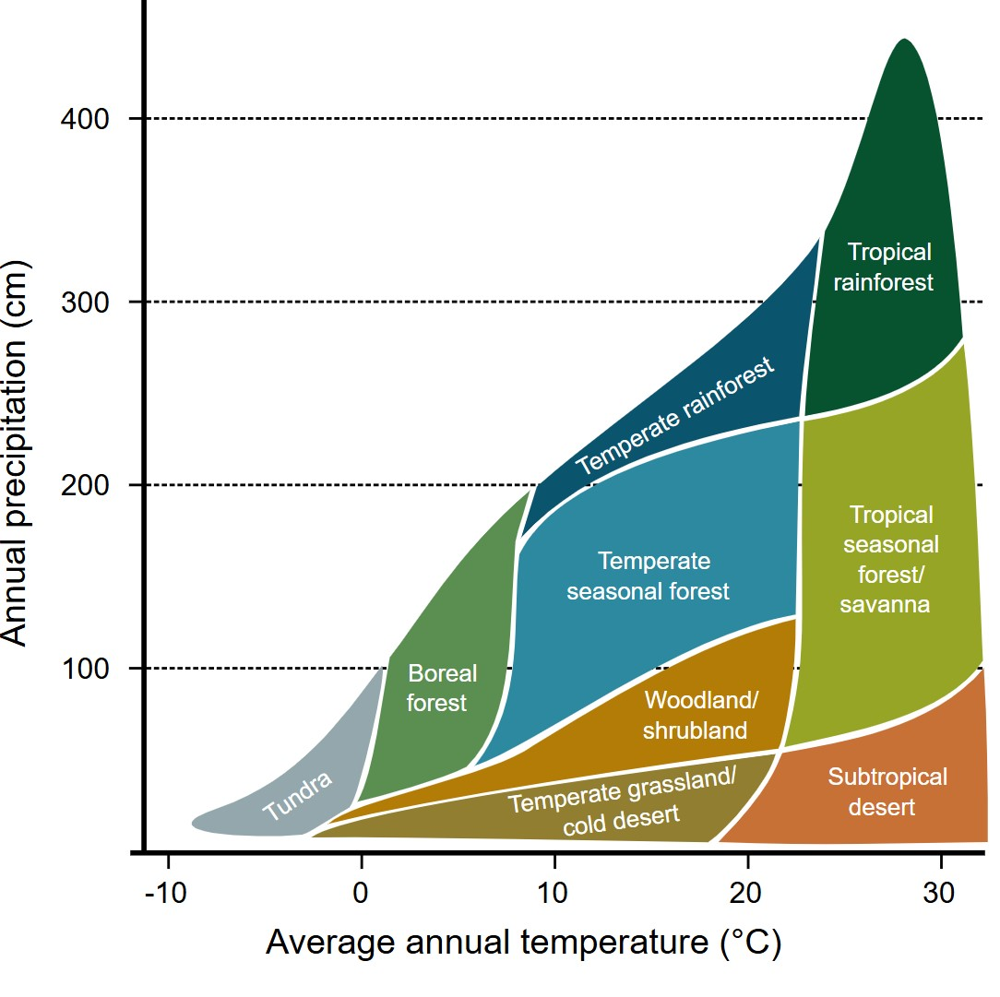

# Data Analysis

<br />

Now we are going to do the data analysis in R. First we have to set the working directory to the correct folder and import the data. Force yourself to import the data through code (with the read.csv function) instead of manually importing the data. The following code combines the different datasets into one dataframe (*df*) which we will use from there on.

```R
# Set the working directory to YOUR folder
setwd("C:/Users?/?")

# Load in the biodiversity, geodiversity and climate data
geo <- read.csv("points_geo.csv", header = TRUE, sep = ",")
rich <- read.csv("points_rich.csv", header = TRUE, sep = ",")
rare <- read.csv("points_rare.csv", header = TRUE, sep = ",")
temp <- read.csv("points_temp.csv", header = TRUE, sep = ",")
prec <- read.csv("points_prec.csv", header = TRUE, sep = ",")

# Create dataframe from data
df <- data.frame(geo$mean, rich$mean, rare$mean, temp$mean, prec$mean)
df <- na.omit(df)
colnames(df) <- c("geo","rich","rare","temp","prec")
```

<br />

### Biodiversity over geodiversity

It is the moment of truth, we have computed geodiversity over the earth and extracted the biodiversity and geodiversity values for 100 randomly placed points. Can we find a linear relationship between biodiversity and geodiversity? Let's explore that question based on species richness and species rarity:

```R
# Relationship between geodiversity and species richness
richgeo <- lm(rich ~ geo, data = df)
summary(richgeo)
plot(rich ~ geo, data=df)
abline(richgeo)

# Relationship between geodiversity and pecies rarity
raregeo <- lm(rare ~ geo, data = df)
summary(raregeo)
plot(rare ~ geo, data=df)
abline(raregeo)
```

<br />

Look at the plots and the models, does the relationship between geodiversity and biodiversity correspond to what you expected?

> 📝 **Question 7**. Looking at the linear models between biodiversity and geodiversity, what can you say about the significance of these relationships on an alpha-level of 5%?
> <br />
> • There is a significant relationship between geodiversity and species richness but not for species rarity <br />
> • There is a significant relationship between geodiversity and species rarity but not for species richness <br />
> • Both models show a significant relationship <br />
> • None of the models show a significant relationship <br />

<br />

```R
# First check the plot between temperature and precipitation
plot(prec ~ temp, data =df)

# Relationship between temperature / precipitation and species richness
richtemp <- lm(rich ~ temp, data = df)
summary(richtemp)
plot(rich ~ temp, data=df)
abline(richtemp)

richprec <- lm(rich ~ prec, data = df)
summary(richprec)
plot(rich ~ prec, data=df)
abline(richprec)
```

<br />

> 🔍 **Review 5**. Look at the plot showing the relationship between precipitation and temperature. Does the distribution of the points in this plot make sense to you? <br />

<br />
<details>
<summary>Answer Review 5. (click on this to show/hide the answer)</summary>
Yes, the distribution of the point cloud is consistent with the possible climate that we observe on earth. Look at the picture underneath explaining the different biomes by the combination of precipitation and temperature. The point cloud follows the same kind of 'triangular' shape. High values of precipitation do not really occur at low temperatures for instance.
<br />
<div align="center">
  
  <br />
  <em>Figure 4. Distribution of biomes over precipitation and temperature gradients.</em>
</div>
</details>
<br />


> 📝 **Question 8**. Look at the plot between precipitation and species richness. Do you think a linear model is fitting for this data?
> <br />
> • Yes, there is a clear significant relationship between the two variables. <br />
> • No, the relationship between the variables appears to be more logarithmic.  <br />
> • Yes, the R-squared value shows that the majority of the variation is explained by this model. <br />
> • No, the slope coefficient (~0.02) is too small to confirm a linear relationship. <br />

<br />

Now also investigate the relationship between temperature and precipitation with species rarity. Write this code yourself by copying the code that analyzes the species richness with the climate data and adjust it to species rarity.

> 📝 **Question 9**. Looking at the linear models between rarity and temperature / precipitation, what can you say about the significance of these relationships on an alpha-level of 5%?
> <br />
> • There is a significant relationship between rarity and temperature but not for precipitation <br />
> • There is a significant relationship between rarity and precipitation but not for temperature <br />
> • Both models show a significant relationship <br />
> • None of the models show a significant relationship <br />

<br />

Let's bring it now all together, what has climate data have to do with geodiversity? Well, you could wonder if the species richness and / or rarity differ over geodiversity if you would take precipitation and temperature into account. This means that we want to observe the relationship of just geodiversity with biodiversity, regardless of how cold/warm or dry/humid it is. Luckily, we are able to do just that with statistics! 

To accurately examine the relationship between two variables, while accounting for the influence of a third (or fourth etc.) variable, is what we call controlling for a variable. You can control for a variable by including this variable as a covariate in the model. When we add more explanatory variables to linear regression, we run a multiple linear regression model, which in this case would be:

[ Y = \beta_0 + \beta_1 X_1 + \beta_2 X_2 + \epsilon ]

the first and second variable while accounting for the influence of a third variable
This is what we call controlling for a variable. you can include the third variable as a covariate in the model.


```R
# With precipitation and temperature
richgeo_tempprec <- lm(rich ~ ? + ? + ?, data = df)
summary(richgeo_tempprec)

# With precipitation and temperature
raregeo_tempprec <- lm(rare ~ ? + ? + ?, data = df)
summary(raregeo_tempprec)
```

> 📝 **Question 10**. What is the change in relationship between geodiversity and species richness & rarity now that you accounted for temperature and precipitation? Compare the results from the simple linear regression with the multiple linear regression and include the slope and the significance (especially of the geodiversity) in your explanation.

<br />
<br />


<nav>
  <ul>
    <li><a href="geodiversity.html">Step 1: Problem Description</a></li>
    <li><a href="geodiversity.html">Step 2: Geodiversity</a></li>
    <li><strong>Step 3: Data Analysis</strong></li>
    <li><a href="../"><b>Back to Overview Page</b></a></li>
  </ul>
</nav>


