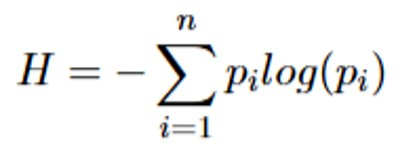

### Agricultural Richness

Given the binary files that we calculated earlier, the 'richness' of agricultural crops can be determined by simply adding all binary rasters together:

```R
# add all the binary rasters to just get a count of the amount of crops in a certain pixel: 
raster_stack_bin <- rast(binary_raster_list)
summed_rasterbin <- sum(raster_stack_bin, na.rm = TRUE)
plot(summed_rasterbin, main = "Summed bin Raster (NAs Ignored)")
```

<br />

> 📝 **Question 3**. Given this map, what is the maximum amount of different crops cultivated in a grid cell? <br />
<br />

Similarly, we can also calculate the total area of cropland in each pixel. Instead of adding the binary files, we just sum the original rasters that contains the crop area for each crop.

```R
# add all the raw rasters to get a total area of cropland
raster_stack <- rast(raster_list)
summed_raster <- sum(raster_stack, na.rm = TRUE)

croparea_df <- as.data.frame(summed_raster, xy = TRUE, na.rm = TRUE)

ggplot() +
    geom_raster(data = croparea_df, aes(x = x, y = y, fill = sum)) +
    geom_sf(data = shapefile_data, fill = NA, color = "black") +
    coord_sf(xlim = c(-180, 180), ylim = c(-90, 90)) +
    scale_fill_viridis_c(limits = c(0, 10000)) +
    theme_minimal() +
    labs(title = "Total crop area per cell in hectares",
         fill = "Crop area in ha")

#the summed raster file is now the SUMFik. We need this to calculate the Fi,k as defined by Leff et al, i.e. the relative crop fraction for each of the crops.
```

> 📝 **Question 4**. Leff et al (2004) talks about "...major crop belts throughout the world." Given the figure you made above, which areas would you indicate as major crop belts? Select all the answers that show a high amount of crop area. <br />
<br />

<br />

Now that we have the total crop area, we can calculate the relative crop fraction for each of the crops. In the paper by Leff et al. (2004) this is being indicated as *Fi,k*. i.e. the crop area of a certain crop in a pixel compared to the total crop area in that pixel (the latter is denoted by SUMFik, or summed_raster in our R code). Let's calculate Fi,k for all crops in all pixels:

```R 
#now we can calculate the relative fraction of all the files
# we will have to write a Function to divide each raster by the summed raster, handle NAs in the summed raster
divide_raster <- function(r, summed) {
  result <- r / summed
  result[is.na(summed)] <- NA  # Ensure that pixels with NA in summed raster remain NA
  return(result)
}

Fik_list <- lapply(raster_list, divide_raster, summed = summed_raster)
plot(Fik_list[[?]], main = "relative fraction")
```

> 📝 **Question 5**. Where is the highest relative fraction of Cassava being grown? <br />
> <br />
> • India <br />
> • Indonesia. <br />
> • Amazonia  <br />
> • Central Africa <br />

<br />

It is time to step away from the Agricultural Commodity Diversity index as defined by Leff. Instead, we will calculate our own diversity index, inspired by the Shannon index for biodiversity. Remember the formula for the Shannon Index? It calculates the diversity of species in a particular community:

<div align="center">
  
  <br />
  <em>Figure 1. Formula for the Shannon Index</em>
</div>

where:
- H: Shannon index
- Σ: Greek symbol for “sum”
- ln: Natural log
- pi: The proportion of community i

<br />

The lower the value of H, the lower the diversity and vica versa. Whereas a value of H = 0 indicates a community that only has one species. In the lectures you learned that *pi* is the proportion a certain species and H representing the diversity in species. In this case we are going to apply the formula to calculate agricultural diversity, in which *pi* is the proportion of a certain crop. Originally Claude Shannon created the index to represent entropy in the field of information theory. Nowadays it is widely used by biologist to indicate biodiversity. This is a fine example of the benefit of interdisciplinary collaboration, in which the knowledge of one discipline can very well create innovative approaches in another!

Now calculate the Shannon Index for our crop dataset:


```R
# Now we can start calculating the shannons index
# Function to calculate Fik * log(Fik) while handling NA values
calculate_log_fraction <- function(r) {
  # Replace NA with 0 before calculating log (to avoid -Inf)
  r[is.na(r)] <- 0
  # Calculate Fik * log(Fik), handling log(0) as 0
  result <- ifel(r > 0, r * log(r), 0)  # Use ifel to avoid log(0) issue
  return(result)
}
# Apply the calculation to each raster in Fik_list
log_fraction_list <- lapply(Fik_list, calculate_log_fraction)
log_fraction_stack <- rast(log_fraction_list)
Shannon <- sum(log_fraction_stack, na.rm = TRUE)*-1
plot(Shannon, main = "shannon index")
```

<br />

This Shannon map now shows the agricultural diversity expressed as a ‘Shannon’s index’. Now we can couple this to a countries vulnerability to the effects of climate change on food security. For this, we base ourselves on the gain-new ranking, which [ranks countries](https://gain-new.crc.nd.edu/ranking/vulnerability/food) in terms of their vulnerability to climate change with a focus on the dimension of food. 
The Food score captures a country’s vulnerability to climate change, and includes metrics of sensitivity, exposure and adaptive capacity. Indicators include: projected change of cereal yields, projected population growth, food import dependency, rural population, agriculture capacity, and child malnutrition. Page 16 of the ND-gain Technical Report gives you an idea about the variables available, we will look at overall vulnerability of countries to climate change regarding food.

```R  
food <- read.csv("nd_gain_countryindex_2024/resources/vulnerability/food.csv")
```

<br />

> 📝 **Question 6**. Why is the projected change in cereal yield included in the food vulnerability score? <br />
<br />

This is a CSV file, but of course, we also want to check the spatiality (we want to link these values to the the crop diversity. To do this, we will need to import a shapefile of the world, so that we can merge the csv (non-spatial dataset) with the shapefile (a spatial dataset). Later on, this shapefile can then be used to extract the raster values we calculated earlier.

```R 
#now we have to couple the 'food' variable with the shapefile_data
head(shapefile_data)

# We see that the iso3 and ISO3 comes back in both: let's merge them. 
merged_data <- shapefile_data %>%
  left_join(food, by = c("iso3" = "ISO3"))
```

<br />

Finally, now that we have a shapefile with all the vulnerability scores, we can extract the zonal statistics (e.g. the median Shannon index) for each country;

```R
#now we extract zonal statistics
library(exactextractr)
zonal_stats <- exact_extract(Shannon, merged_data, fun = "median")
merged_data$shannon_median <- zonal_stats
```

<br />

This final data can now be used for visualization and statistics.


```R 
plot(merged_data$X2022, merged_data$shannon_median)

data_to_plot <- merged_data %>%
  select(name, continent, shannon_median, X2022) %>% na.omit()

# Create interactive plot
interactive_plot <- data_to_plot %>%
  ggplot( aes(X2022, shannon_median, color=continent, text=name)) +
  geom_point() +
  theme_bw()

# Show the interactive plot
interactive_plot<-ggplotly(interactive_plot)
htmlwidgets::saveWidget(interactive_plot, "interactive_plot.html")
```

The plot will be saved as an interactive plot as a html webpage in your working directory. Go to your working directory and find the file there!
Open it and inspect the plot, can you find the Netherlands?

<br />

> 📝 **Question 7**. How much of the variation in the food vulnerability index can be explained by Shannon median index? <br />

<br />

> 📝 **Question 8**. Which countries have a relatively high Food Vulnerability score and a low Shannon Index? Explain if there is a connection to the climate of those countries. <br />
<br />

<br />


**You made it to the end of all six practicals, Well Done!**

<nav>
  <ul>
    <li><a href="intro.html">Step 1: Crop Area</a></li>
    <li><strong>Step 2: Agricultural Diversity</strong></li>
    <li><a href="../"><b>Back to Overview Page</b></a></li>
  </ul>
</nav>

